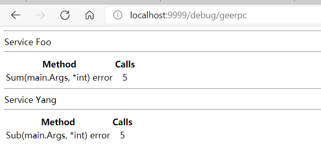

# geektutu ———— RPC框架GeeRPC学习

## 支持HTTP协议

支持HTTP协议是为了可以提供除了RPC调用之外的服务，比如可以基于HTTP实现一个简单的Debug页面统计已注册的服务及其调用次数。

### HTTP的CONNECT方法

CONNECT方法一般用于代理服务。
假设浏览器（**也就是客户端**）与服务器之间采用HTTPS加密通信，浏览器通过代理服务器发起HTTPS请求时，由于请求的站点地址和端口号都是加密的，代理服务器不知道该往哪里转发这个请求。为了解决这个问题，浏览器可以先通过HTTP协议明文**向代理服务器发送一个CONNECT请求**告诉代理服务器目标地址和端口，代理服务器收到这个请求后会与目标站点建立一个TCP连接，用于转发接下来浏览器发送给站点的加密报文。
这一过程可以看作是通过向代理服务器发送CONNECT请求，实现了将HTTP协议转为HTTPS协议的过程。后续客户端-服务器之间的通信全为HTTPS协议。

由于RPC的消息格式和标准的HTTP协议不兼容，要支持HTTP协议则需要一个协议的转换过程。可以采用HTTP协议的CONNECT方法来实现。

### 服务端支持HTTP协议

对于RPC服务端来说，支持HTTP协议要求客户端可以通过HTTP协议与服务端建立连接，但建立连接之后的数据传输则需采用RPC服务端自定义的协议。

```go
    /* **************************************************
    支持HTTP协议相关
    *************************************************** */
    const (
        connected        = "200 Connected to Gee RPC"
        defaultRPCPath   = "/_geerpc_"      // 提供rpc通信的HTTP服务
        defaultDebugPath = "/debug/geerpc"  // 提供debug服务
    )

    func (server *Server) ServeHTTP(w http.ResponseWriter, req *http.Request) {
        if req.Method != "CONNECT" {    // 该服务只接收客户端的CONNECT请求 用于建立连接
            w.Header().Set("Content-Type", "text/plain; charset=utf-8")
            w.WriteHeader(http.StatusMethodNotAllowed)
            _, _ = io.WriteString(w, "405 must CONNECT\n")
            return
        }
        // 使用Hijack()获取HTTP连接中的TCP连接 由调用者自己管理 此后只能从conn读写数据
        conn, _, err := w.(http.Hijacker).Hijack()
        if err != nil {
            log.Print("rpc hijacking ", req.RemoteAddr, ": ", err.Error())
            return
        }
        // 表示连接已经建立
        _, _ = io.WriteString(conn, "HTTP/1.0 "+connected+"\n\n")   // 客户端收到时会将协议版本后面的内容作为完整的响应内容
        server.ServeConn(conn)  // RPC协议进行通信
    }

    func (server *Server) HandleHTTP() {
        http.Handle(defaultRPCPath, server)
        http.Handle(defaultDebugPath, debugHTTP{server})
        log.Println("rpc server debug path:", defaultDebugPath)
    }

    func HandleHTTP() {
        DefaultServer.HandleHTTP()
    }
```

Go语言的http标准库里有一个接口类型```Handler```定义了方法```ServeHTTP(w ResponseWriter, r *Request)```，实现了该方法的类型可以作为一个Handler处理HTTP请求。上面代码中，```Server```实现了该方法用于处理HTTP请求，并通过```http.Handle(pattern string, handler Handler)```将Server与“/_geerpc_”这个URL绑定起来。因此，当客户端通过HTTP连接访问/_geerpc_时就会执行```Server.ServeHTTP```这个方法。

```Server.ServeHTTP```方法用于RPC服务端和RPC客户端建立RPC通信。客户端会通过HTTP协议发送CONNECT请求。服务端只接收CONNECT请求，并通过```Hijack()```方法获取HTTP连接中的TCP连接，将该TCP连接交给RPC服务端管理，**这里便是实现了HTTP协议到RPC协议的转换**。因为得到TCP连接后，服务端根据自定义的RPC协议通过该TCP连接发送RPC报文。

### 客户端支持HTTP协议

对于RPC客户端来说，支持HTTP协议要求客户端能通过HTTP协议与服务端建立连接。所以需要在客户端新增通过HTTP的CONNECT请求建立连接的逻辑。

```go
    func NewHTTPClient(conn net.Conn, opt *Option) (*Client, error) {
        // HTTP请求报文第一行为请求行，请求行格式：请求方法 URL 协议版本
        // 直接构造HTTP报文的格式 向连接conn发送，CONNECT请求
        _, _ = io.WriteString(conn, fmt.Sprintf("CONNECT %s HTTP/1.0\n\n", defaultRPCPath))
        // 接收服务端对CONNECT请求的响应
        resp, err := http.ReadResponse(bufio.NewReader(conn), &http.Request{Method: "CONNECT"})
        if err == nil && resp.Status == connected { // Status存储了响应信息 不包括协议版本
            return NewClient(conn, opt)
        }
        if err == nil {
            err = errors.New("unexpected HTTP response: " + resp.Status)
        }
        return nil, err
    }

    func DialHTTP(network, address string, opts ...*Option) (*Client, error) {
        return dialTimeout(NewHTTPClient, network, address, opts...)
    }
```

创建客户端时仍然延续之前的逻辑，先通过```net.DialTimeout```建立连接，再通过新增的```NewHTTPClient```方法创建一个支持HTTP协议的客户端。
客户端首先需要向服务器发送CONNECT请求，基于HTTP请求报文的格式，报文第一行为请求行，包括请求方法、URL、版本号（由空格隔开）。因此直接构造CONNECT请求报文发送给服务器```io.WriteString(conn, fmt.Sprintf("CONNECT %s HTTP/1.0\n\n", defaultRPCPath))```。
服务器确认是CONNECT请求后会返回可以建立连接的响应：```io.WriteString(conn, "HTTP/1.0 "+connected+"\n\n")```。客户端采用```http.ReadResponse(bufio.NewReader(conn), &http.Request{Method: "CONNECT"})```读取之前发送的CONNECT请求的响应，检查是否能够创建客户端。

在此处，HTTP协议只是用于前期建立连接。可以看作是把服务器处理RPC调用的功能作为一个HTTP服务。

## 基于HTTP实现一个简单的Debug页面

这个页面用于统计已注册的服务及其调用次数，也是为了印证支持HTTP协议可以使服务器提供更多功能。

```go
    const debugText = `<html>
        <body>
        <title>GeeRPC Services</title>
        {{range .}}
        <hr>
        Service {{.Name}}
        <hr>
            <table>
            <th align=center> Method</th><th align=center> Calls</th>
            {{range $name, $mtype := .Method}}
                <tr>
                <td align=left front=fixed>{{$name}}({{$mtype.ArgType}}, {{$mtype.ReplyType}}) error</td>
                <td align=center>{{$mtype.NumCalls}}</td>
                </tr>
            {{end}}
            </table>
        {{end}}
        </body>
        </html>`

    var debug = template.Must(template.New("RPC debug").Parse(debugText))

    type debugService struct {
        Name   string
        Method map[string]*methodType
    }
```

页面包括了前端展示部分，Go的内置库```html/template```提供了这种功能。
首先定义了html模板，该模板展示了已注册到服务器上的类型、类型提供的可被远程调用的方法以及方法对应的调用次数。要展示的数据是上面代码中的```debugService```数组。因此模板中的```.Name```对应了```debugService.Name```，```.Method```对应了```debugService.Method```。
通过```template.New```创建一个模板，再由```Template.Parse(模板内容)```解析模板得到一个可展示的html模板。```template.Must```函数只是一个检查是否出错的辅助函数。

```go
    type debugHTTP struct {
        *Server
    }

    func (server debugHTTP) ServeHTTP(w http.ResponseWriter, req *http.Request) {
        var services []debugService
        server.serviceMap.Range(func(namei, svci interface{}) bool { // Range用于遍历syncMap并对每个键值对执行作为参数的函数
            svc := svci.(*service)
            services = append(services, debugService{
                Name:   namei.(string),
                Method: svc.method,
            })
            return true
        })
        err := debug.Execute(w, services)
        if err != nil {
            _, _ = fmt.Fprintln(w, "rpc: error executing template: ", err.Error())
        }
    }

    func (server *Server) HandleHTTP() {
        http.Handle(defaultRPCPath, server)
        http.Handle(defaultDebugPath, debugHTTP{server})
        log.Println("rpc server debug path:", defaultDebugPath)
    }
```

```debugHTTP```结构体实现了```ServeHTTP```方法，因此可以处理HTTP请求。该方法的实际作用是获取RPC服务器上已注册的服务并展示。通过```debug.Execute(w, services)```将数据以网页的形式展示出来。

## 交互方式

```go
    type Args struct{ Num1, Num2 int }

    type Foo int
    func (f Foo) Sum(args Args, reply *int) error {
        *reply = args.Num1 + args.Num2
        return nil
    }

    type Yang int
    func (y Yang) Sub(args Args, reply *int) error {
        *reply = args.Num2 - args.Num1
        return nil
    }

    func startServer(addr chan string) {
        var foo Foo
        var yang Yang
        l, err := net.Listen("tcp", ":9999")
        if err != nil {
            log.Fatal("network error: ", err)
        }
        if err := geerpc.Register(foo); err != nil {
            log.Fatal("register error: ", err)
        }
        if err := geerpc.Register(yang); err != nil {
            log.Fatal("register error: ", err)
        }
        geerpc.HandleHTTP()     // 注册HTTP服务
        addr <- l.Addr().String()
        _ = http.Serve(l, nil)  // 监听并处理HTTP服务
    }

    func call(addr chan string) {
        client, _ := geerpc.DialHTTP("tcp", <-addr)
        defer client.Close()

        time.Sleep(time.Second)

        var wg sync.WaitGroup
        for i := 0; i < 5; i++ {
            wg.Add(1)
            go func(i int) {
                defer wg.Done()
                args := &Args{Num1: i, Num2: i * i}
                var reply int
                if err := client.Call(context.Background(), "Foo.Sum", args, &reply); err != nil {
                    log.Fatal("call Foo.Sum error: ", err)
                }
                log.Printf("%d + %d = %d\n", args.Num1, args.Num2, reply)
                if err := client.Call(context.Background(), "Yang.Sub", args, &reply); err != nil {
                    log.Fatal("call Foo.Sum error: ", err)
                }
                log.Printf("%d - %d = %d\n", args.Num2, args.Num1, reply)
            }(i)
        }
        wg.Wait()
    }

    func rpcDemo() {
        addr := make(chan string)
        go call(addr)
        startServer(addr)
    }
```

注册了两个RPC服务，服务器通过```geerpc.HandleHTTP()```注册HTTP服务，包括提供RPC功能的服务和获取debug页面的服务，同时通过9999端口监听HTTP服务。
客户端通过```geerpc.DialHTTP```建立与服务器的连接，此后仍然采用```Call```方法进行RPC调用。

debug页面效果如下图：

